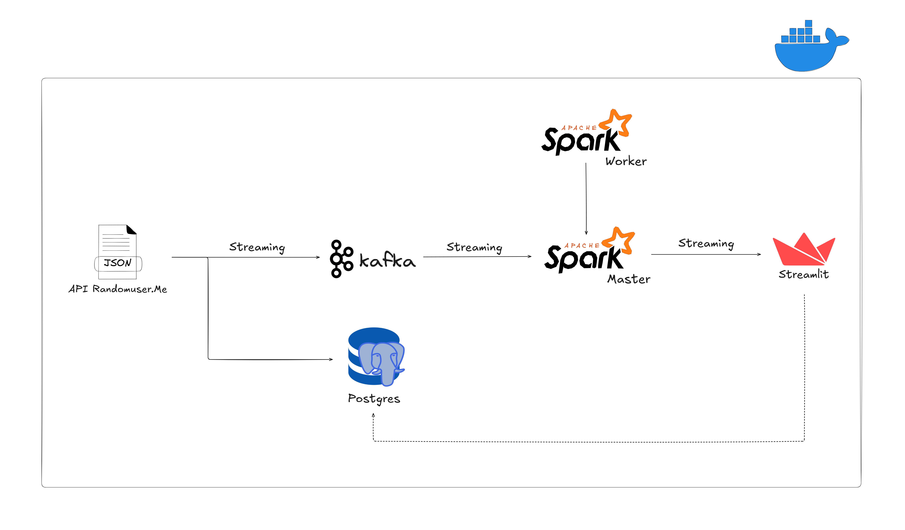
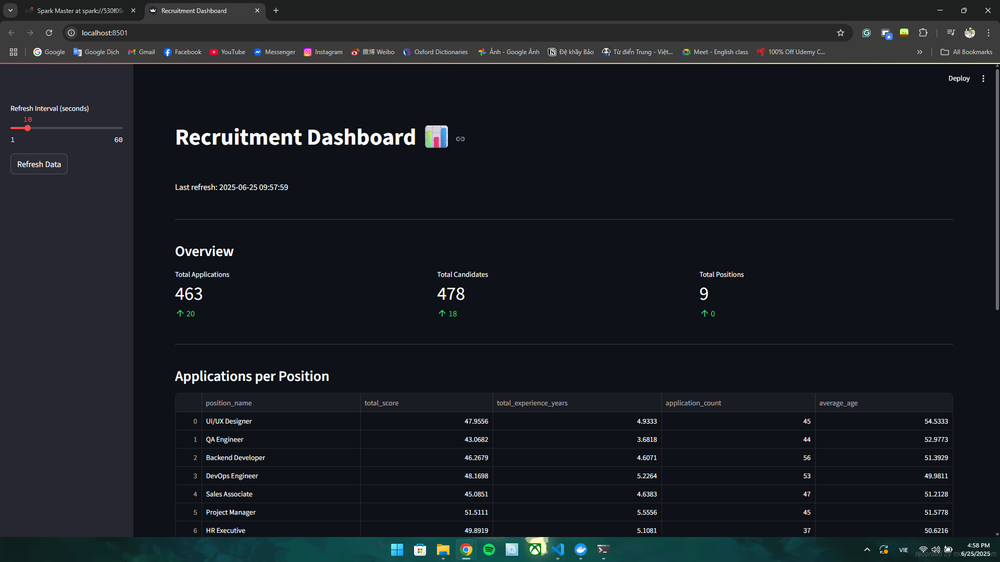
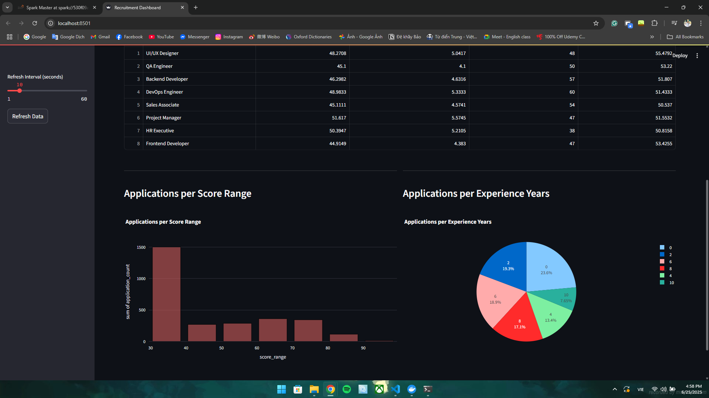

# 📊 Realtime Recruitment Analytics Platform

Realtime Recruitment Analytics Platform is a real-time data pipeline that simulates and visualizes job application processes using modern data engineering tools. It generates synthetic candidate data, processes application logic, aggregates metrics via Apache Spark Streaming, and delivers insights through an interactive Streamlit dashboard — all orchestrated with Docker containers. This project demonstrates how to build a scalable streaming system from data ingestion to real-time visualization.

---

## 🛠️ Technologies

* Kafka: Real-time message broker
* PostgreSQL: Persistent data store
* Apache Spark (Structured Streaming): Real-time data aggregation
* Streamlit: Interactive dashboard
* Docker Compose: Service orchestration

---

## 🚀 Architecture Overview



---

## 🧱 Main Components

| Component            | Description                                                                 |
|----------------------|-----------------------------------------------------------------------------|
| `candidate.py`       | Generates random candidate data from API, pushes to Kafka & PostgreSQL     |
| `application.py`     | Listens for candidates, selects random position, and pushes application     |
| `spark_streaming.py` | Consumes applications, performs aggregation, and sends to Kafka topics      |
| `streamlit_app.py`   | Displays live dashboard from Kafka and PostgreSQL data                      |

---

## 📂 Project Structure

```
.
├── scripts/
│ ├── candidate.py
│ ├── application.py
│ ├── spark_streaming.py
│ └── streamlit_app.py
├── init.sql
├── requirements.txt
├── docker-compose.yml
├── Dockerfile.base
├── Dockerfile.streaming
├── images/ # (Optional) for dashboard screenshots
└── README.md
```

---

## ✅ Features

* Real-time data pipeline with Kafka + Spark Structured Streaming
* Persistent storage in PostgreSQL
* Live and auto-refreshing dashboard built with Streamlit + Plotly
* Application insights:
    * Per position
    * By score range
    * By years of experience

---

## 📸 Dashboard Example




---

## 🐳 Getting Started

### 1. Clone the Repository

```bash
git clone https://github.com/daley12306/RealtimeRecruitment.git
cd RealtimeRecruitment
```

### 2. Build & Start Docker containers:

To build and start all services:

```bash
docker compose up --build -d
```
To scale Spark workers (e.g., to run with 3 workers):

```bash
docker compose up --scale spark-worker=3 --build -d
```

### 3. Access the Spark UI

Open your browser at: [http://localhost:8080](http://localhost:8080)

### 4. Access the dashboard

Open your browser at: [http://localhost:8501](http://localhost:8501)

---

## 🛢️ PostgreSQL:

The `init.sql` script initializes the `candidate`, `position`, and `application` tables, along with some default positions.

### Credentials:

* User: `postgres`
* Password: `secret`

### Access PostgreSQL manually:

```bash
docker exec -it postgres psql -U postgres -d recruitment
```

---

## 🔗 Kafka CLI

You can inspect and consume Kafka topics using the following commands (from inside a container that has Kafka tools installed):

### List all topics:

```bash
docker exec -it broker kafka-topics --list --bootstrap-server broker:29092
```

### Consume messages from a specific topic (e.g., `applications_per_position`):

```bash
docker exec -it broker kafka-console-consumer --topic applications_per_position --bootstrap-server broker:29092
```

---

## 🪩 Clean Up

To shut down and remove all containers and volumes:

```bash
docker compose down -v
```
